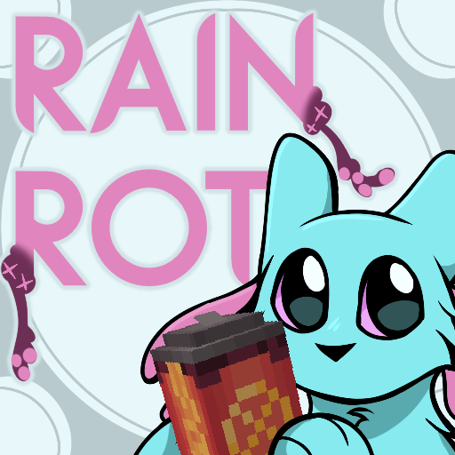

# Rain Rot

Rain Rot is a Minecraft mod that adds various things from (and inspired by) [Rain World](https://rainworldgame.com). In particular, the mod adds plushies of the slugcats and iterators, alongside some other things. Despite the name, the mod does not contain rot (yet).

### Licensing

In short: the assets (everything under `src/main/resources`) is [CC-BY 4.0](LICENSE.ASSETS.txt) and everything else is [LGPL 2.1](LICENSE.CODE.md).